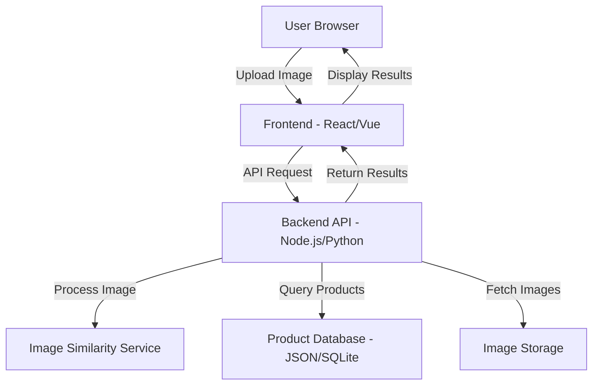

# Design Document: Visual Product Matcher

## Overview

The Visual Product Matcher is a web application that leverages image similarity algorithms to help users discover visually similar products. The system consists of a frontend web interface, a backend API for image processing, and integration with a pre-trained image similarity service (using embeddings or feature extraction).

The architecture follows a client-server model where the frontend handles user interactions and display, while the backend manages image processing, similarity computation, and product database queries. To meet the 8-hour development timeline and free hosting requirements, we'll use existing ML services (like TensorFlow.js, Hugging Face Inference API, or similar) rather than training custom models.

## Architecture

### High-Level Architecture



### Technology Stack Options

**Frontend:**
- React or Vue.js for UI components
- Tailwind CSS or Bootstrap for responsive design
- Axios for API communication

**Backend:**
- Node.js with Express (lightweight, fast development, excellent ecosystem)

**Image Similarity:**
- TensorFlow.js with MobileNet for server-side processing in Node.js
- OR Hugging Face Inference API (CLIP model) via REST calls
- OR Replicate API for CLIP embeddings

**Database:**
- JSON file for simple product storage (50 products)
- OR SQLite for structured queries

**Hosting:**
- Frontend: Vercel, Netlify, or GitHub Pages
- Backend: Vercel serverless functions, Railway, or Render (free tier)
- Images: Cloudinary free tier or GitHub repository

### Component Interaction Flow

1. User uploads image via frontend
2. Frontend sends image to backend API
3. Backend extracts image embeddings/features using ML service
4. Backend compares embeddings with pre-computed product embeddings
5. Backend calculates similarity scores (cosine similarity)
6. Backend returns ranked product list
7. Frontend displays results with filtering options

## Components and Interfaces

### Frontend Components

#### UploadInterface Component
```typescript
interface UploadInterfaceProps {
  onImageSubmit: (image: File | string) => void;
  isLoading: boolean;
}

interface ImageInput {
  type: 'file' | 'url';
  data: File | string;
}
```

Responsibilities:
- Render file upload button and URL input field
- Validate image format and size
- Display image preview
- Emit image data to parent component

#### SearchResults Component
```typescript
interface Product {
  id: string;
  name: string;
  category: string;
  imageUrl: string;
  similarityScore: number;
}

interface SearchResultsProps {
  uploadedImage: string;
  products: Product[];
  onFilterChange: (minScore: number) => void;
  isLoading: boolean;
}
```

Responsibilities:
- Display uploaded image
- Render product grid with similarity scores
- Provide similarity threshold filter
- Show loading states

#### FilterControl Component
```typescript
interface FilterControlProps {
  minScore: number;
  maxScore: number;
  currentThreshold: number;
  onThresholdChange: (threshold: number) => void;
  resultCount: number;
}
```

Responsibilities:
- Render slider for similarity threshold
- Display current filter value
- Show filtered result count

### Backend API Endpoints

#### POST /api/search
```typescript
Request:
{
  image: string (base64) | File (multipart),
  type: 'file' | 'url'
}

Response:
{
  success: boolean,
  uploadedImageUrl: string,
  results: Product[],
  processingTime: number
}

Error Response:
{
  success: false,
  error: string,
  code: 'INVALID_IMAGE' | 'PROCESSING_ERROR' | 'SERVICE_UNAVAILABLE'
}
```

#### GET /api/products
```typescript
Response:
{
  products: Product[],
  count: number
}
```

### Backend Services

#### ImageProcessor Service
```javascript
class ImageProcessor {
  /**
   * Extract feature embeddings from image using pre-trained model
   * @param {Buffer} imageBuffer - Image data
   * @returns {Promise<Float32Array>} Feature embeddings
   */
  async extractFeatures(imageBuffer) {
    // Use TensorFlow.js or external API
  }
  
  /**
   * Compute cosine similarity between two embeddings
   * @param {Float32Array} embedding1 
   * @param {Float32Array} embedding2 
   * @returns {number} Similarity score (0-1)
   */
  computeSimilarity(embedding1, embedding2) {
    // Cosine similarity calculation
  }
  
  /**
   * Validate image format and size
   * @param {Buffer} imageBuffer 
   * @returns {boolean} Is valid
   */
  validateImage(imageBuffer) {
    // Check format and size
  }
}
```

#### ProductDatabase Service
```javascript
class ProductDatabase {
  /**
   * Load products from storage
   * @returns {Promise<Product[]>}
   */
  async loadProducts() {
    // Load from JSON file
  }
  
  /**
   * Get pre-computed embeddings for all products
   * @returns {Promise<Map<string, Float32Array>>}
   */
  async getProductEmbeddings() {
    // Load embeddings from storage
  }
  
  /**
   * Find top-k similar products
   * @param {Float32Array} queryEmbedding 
   * @param {number} topK 
   * @returns {Promise<Array<{product: Product, score: number}>>}
   */
  async searchSimilar(queryEmbedding, topK = 20) {
    // Compare with all product embeddings
  }
}
```

## Data Models

### Product Model
```typescript
interface Product {
  id: string;              // Unique identifier
  name: string;            // Product name
  category: string;        // Product category (e.g., "Electronics", "Clothing")
  imageUrl: string;        // URL or path to product image
  embedding?: number[];    // Pre-computed image embedding (stored separately)
  metadata?: {             // Optional additional data
    brand?: string;
    price?: number;
    description?: string;
  };
}
```

### SearchResult Model
```typescript
interface SearchResult {
  product: Product;
  similarityScore: number;  // 0-100 percentage
  rank: number;             // Position in results
}
```

### Database Schema (JSON)
```json
{
  "products": [
    {
      "id": "prod_001",
      "name": "Wireless Headphones",
      "category": "Electronics",
      "imageUrl": "/images/products/headphones_001.jpg",
      "metadata": {
        "brand": "AudioTech",
        "description": "Noise-cancelling wireless headphones"
      }
    }
  ],
  "embeddings": {
    "prod_001": [0.123, 0.456, ...]
  }
}
```

## Correctness Properties

*A property is a characteristic or behavior that should hold true across all valid executions of a system—essentially, a formal statement about what the system should do. Properties serve as the bridge between human-readable specifications and machine-verifiable correctness guarantees.*


### Property 1: Valid image file acceptance and preview
*For any* valid image file (JPEG, PNG, WebP, GIF) within size limits, uploading it should result in the file being accepted and a preview being displayed.
**Validates: Requirements 1.1, 1.5**

### Property 2: URL-based image loading
*For any* valid image URL, providing it to the system should result in the image being fetched and displayed.
**Validates: Requirements 1.2**

### Property 3: Invalid input rejection
*For any* invalid file type or oversized image, the system should reject the input, display an appropriate error message, and maintain the current application state.
**Validates: Requirements 1.3, 1.4, 1.6**

### Property 4: Search results ordering
*For any* set of search results, the products should be ordered by similarity score in descending order (highest similarity first).
**Validates: Requirements 2.4**

### Property 5: Result completeness
*For any* product in the search results, the displayed information should include the product image, name, category, and similarity score.
**Validates: Requirements 2.3**

### Property 6: Uploaded image display with results
*For any* successful search, the results view should display both the uploaded image and the matching products.
**Validates: Requirements 2.2**

### Property 7: Similarity threshold filtering
*For any* similarity threshold value, the filtered results should only include products with similarity scores greater than or equal to that threshold, and the displayed count should match the number of filtered results.
**Validates: Requirements 3.1, 3.4**

### Property 8: Filter order preservation
*For any* set of search results, applying a similarity threshold filter should maintain the relative order of the remaining products.
**Validates: Requirements 3.3**

### Property 9: Product data integrity
*For any* product in the database, it should contain all required metadata fields: id, name, category, and imageUrl.
**Validates: Requirements 4.2**

### Property 10: Responsive layout adaptation
*For any* viewport size (mobile, tablet, desktop), the system should display an appropriate layout optimized for that screen size.
**Validates: Requirements 5.1, 5.2, 5.3, 5.4**

### Property 11: State preservation during resize
*For any* application state with user data (uploaded image, search results), changing the viewport size should preserve all user data without loss.
**Validates: Requirements 5.5**

### Property 12: Error handling and messaging
*For any* error condition (network failure, processing error, database unavailable), the system should display a user-friendly error message with actionable guidance and log the error for debugging.
**Validates: Requirements 6.1, 6.2, 6.3, 6.4, 6.5**

### Property 13: Loading state indicators
*For any* asynchronous operation (image upload, similarity search, filtering), the system should display a loading indicator while the operation is in progress.
**Validates: Requirements 2.6, 7.1, 7.2, 7.3**

### Property 14: Action button disabling during processing
*For any* ongoing asynchronous operation, action buttons that could trigger duplicate submissions should be disabled until the operation completes.
**Validates: Requirements 7.4**

### Property 15: Cross-browser compatibility
*For any* modern browser (Chrome, Firefox, Safari, Edge), the system should function correctly with all features working as expected.
**Validates: Requirements 8.4**

## Error Handling

### Error Categories

**Client-Side Errors:**
1. **Invalid Image Input**
   - Invalid file format
   - File size exceeds limit
   - Corrupted image file
   - Invalid URL format
   - URL points to non-image resource

2. **Validation Errors**
   - Missing required fields
   - Invalid similarity threshold values

**Server-Side Errors:**
1. **Processing Errors**
   - Image feature extraction failure
   - Embedding computation failure
   - Similarity calculation errors

2. **Service Errors**
   - ML service unavailable
   - API rate limits exceeded
   - Database connection failure

3. **Network Errors**
   - Request timeout
   - Connection refused
   - DNS resolution failure

### Error Handling Strategy

**Frontend Error Handling:**
```typescript
interface ErrorState {
  type: 'validation' | 'network' | 'processing' | 'service';
  message: string;
  actionable: string;  // What user can do
  retryable: boolean;
}

function handleError(error: Error): ErrorState {
  // Categorize error
  // Generate user-friendly message
  // Provide actionable guidance
  // Determine if retry is possible
}
```

**Backend Error Handling:**
```javascript
class APIError extends Error {
  constructor(code, message, statusCode) {
    super(message);
    this.code = code;
    this.statusCode = statusCode;
  }
}

// Error codes
const ErrorCodes = {
  INVALID_IMAGE: 'INVALID_IMAGE',
  PROCESSING_ERROR: 'PROCESSING_ERROR',
  SERVICE_UNAVAILABLE: 'SERVICE_UNAVAILABLE',
  RATE_LIMIT_EXCEEDED: 'RATE_LIMIT_EXCEEDED'
};
```

**Error Recovery:**
- Automatic retry with exponential backoff for transient network errors
- Graceful degradation if ML service is unavailable
- Clear error messages with suggested actions
- Preserve user input on error for easy retry

### Logging Strategy

**Log Levels:**
- ERROR: System failures, unhandled exceptions
- WARN: Recoverable errors, rate limits
- INFO: Successful operations, performance metrics
- DEBUG: Detailed processing information

**Log Format:**
```json
{
  "timestamp": "2024-01-15T10:30:00Z",
  "level": "ERROR",
  "component": "ImageProcessor",
  "message": "Failed to extract features",
  "error": "Model loading timeout",
  "userId": "anonymous",
  "requestId": "req_123"
}
```

## Testing Strategy

### Dual Testing Approach

The testing strategy employs both unit tests and property-based tests to ensure comprehensive coverage:

**Unit Tests** focus on:
- Specific examples demonstrating correct behavior
- Edge cases (empty results, boundary values)
- Error conditions and recovery
- Integration points between components
- Specific browser compatibility checks

**Property-Based Tests** focus on:
- Universal properties that hold for all inputs
- Comprehensive input coverage through randomization
- Invariants that must be maintained
- Data integrity across operations

Both approaches are complementary and necessary for production-quality code.

### Property-Based Testing Configuration

**Framework Selection:**
- **JavaScript/TypeScript**: fast-check library
- **Node.js Backend**: fast-check for property-based testing

**Configuration:**
- Minimum 100 iterations per property test (due to randomization)
- Each property test must reference its design document property
- Tag format: **Feature: visual-product-matcher, Property {number}: {property_text}**

### Test Coverage Areas

**Frontend Tests:**
1. Component rendering with various props
2. User interaction flows (upload, filter, view results)
3. Responsive behavior at different viewport sizes
4. Error state display
5. Loading state transitions

**Backend Tests:**
1. Image validation logic
2. Feature extraction and similarity computation
3. Database queries and filtering
4. API endpoint responses
5. Error handling and logging

**Integration Tests:**
1. End-to-end search flow
2. Image upload to results display
3. Filter application and result updates
4. Error scenarios across the stack

**Property-Based Test Examples:**

```typescript
// Property 4: Search results ordering
test('Feature: visual-product-matcher, Property 4: Search results ordering', () => {
  fc.assert(
    fc.property(
      fc.array(productWithScoreGenerator(), { minLength: 1, maxLength: 50 }),
      (products) => {
        const sorted = sortBysimilarity(products);
        // Verify descending order
        for (let i = 0; i < sorted.length - 1; i++) {
          expect(sorted[i].similarityScore).toBeGreaterThanOrEqual(
            sorted[i + 1].similarityScore
          );
        }
      }
    ),
    { numRuns: 100 }
  );
});

// Property 7: Similarity threshold filtering
test('Feature: visual-product-matcher, Property 7: Similarity threshold filtering', () => {
  fc.assert(
    fc.property(
      fc.array(productWithScoreGenerator()),
      fc.float({ min: 0, max: 100 }),
      (products, threshold) => {
        const filtered = filterByThreshold(products, threshold);
        // All results should meet threshold
        filtered.forEach(product => {
          expect(product.similarityScore).toBeGreaterThanOrEqual(threshold);
        });
        // Count should match
        expect(filtered.length).toBe(
          products.filter(p => p.similarityScore >= threshold).length
        );
      }
    ),
    { numRuns: 100 }
  );
});
```

### Performance Testing

**Key Metrics:**
- Image upload time: < 2 seconds
- Similarity search time: < 10 seconds
- Initial page load: < 5 seconds
- Filter application: < 500ms

**Testing Approach:**
- Measure processing time for various image sizes
- Test with full 50-product database
- Simulate network conditions (3G, 4G, WiFi)
- Monitor memory usage during operations

### Manual Testing Checklist

- [ ] Test on mobile devices (iOS Safari, Android Chrome)
- [ ] Test on tablets (iPad, Android tablet)
- [ ] Test on desktop browsers (Chrome, Firefox, Safari, Edge)
- [ ] Verify HTTPS deployment
- [ ] Test with various image formats and sizes
- [ ] Verify error messages are user-friendly
- [ ] Check loading states appear correctly
- [ ] Validate responsive design breakpoints
- [ ] Test with slow network connections
- [ ] Verify documentation completeness

## Implementation Notes

### Development Approach

Given the 8-hour timeline, prioritize:
1. Core functionality first (upload, search, display)
2. Use existing ML services (don't build from scratch)
3. Simple but effective UI
4. Minimal viable product database (50 products)
5. Basic error handling and loading states
6. Deploy early and iterate

### Recommended Technology Choices

**For Fast Development:**
- **Frontend**: React with Vite (fast setup, hot reload)
- **Styling**: Tailwind CSS (rapid UI development)
- **Backend**: Node.js with Express
- **Image Similarity**: TensorFlow.js with MobileNet or Hugging Face Inference API
- **Database**: JSON file (simple, no setup needed)
- **Hosting**: Vercel (frontend + serverless functions) or Railway (full-stack)

**Alternative Stack:**
- **Full JavaScript**: Next.js with API routes and TensorFlow.js
- **Hosting**: Vercel (all-in-one)
- **Image Similarity**: MobileNet embeddings or external API

### Product Database Setup

**Data Sources:**
- Unsplash API (free, high-quality images)
- Public product datasets (Amazon products, fashion datasets)
- Manual curation of 50 diverse products

**Categories to Include:**
- Electronics (phones, laptops, headphones)
- Clothing (shirts, shoes, accessories)
- Home goods (furniture, decor)
- Sports equipment
- Toys

**Pre-computation:**
- Generate embeddings for all 50 products during setup
- Store embeddings in JSON file alongside product data
- This avoids recomputing embeddings on every search

### Deployment Checklist

- [ ] Environment variables configured
- [ ] HTTPS enabled
- [ ] CORS configured correctly
- [ ] Error logging enabled
- [ ] Product images accessible
- [ ] API rate limits considered
- [ ] README with live URL
- [ ] GitHub repository public
- [ ] Write-up document included
